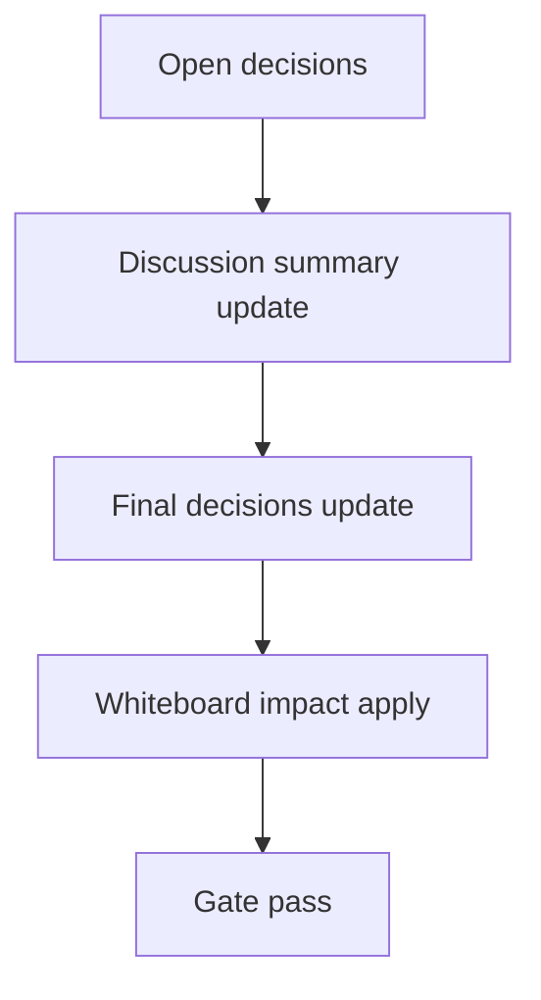

# Design: design_20260304_inspire_star_office_claw_v1

- Status: Draft
- Owner: Codex
- Created: 2026-03-04
- Updated: 2026-03-04
- Scope: Star Office UI + claw-empire inspirations v1: states/yesterday memo/guest push

## Context
- Problem: 状態語彙が旧来の `working/thinking/...` に分散し、Workspaceで「状態が見える」体験が弱い。Dashboardには昨日メモ導線がなく、guestの安全な参加/状態通知導線も不足している。
- Goal: A) 状態語彙を `idle|writing|researching|executing|syncing|error` に統一。B) Dashboardへ Yesterday memo を追加。C) join key必須の Guest join/push/leave を安全デフォルトで追加。
- Non-goals: 既存APIの破壊的変更、外部ネットワーク連携、商用制限のあるアート素材流用。

## Design diagram
```mermaid
%% title: data flow
flowchart LR
  A[Org agents state update] --> B[agent_state_changed activity]
  C[Memory episodes tail] --> D[/api/dashboard/yesterday_memo]
  E[Guest key create/revoke] --> F[guest join/push/leave]
  F --> G[activity guest_* events]
  B --> H[Workspace state zone]
  D --> I[Dashboard Yesterday memo card]
  G --> H
```



## Whiteboard impact
- Now: Before: 状態語彙が分断され、Dashboardに昨日メモがなく、guest参加は未実装。After: 状態語彙統一・Yesterday memo導線・join keyベースguest push導線が追加。
- DoD: Before: 上記機能の自動検証なし。After: `states_ok`/`yesterday_memo_ok`/`guest_join_push_ok` を `tools/ui_smoke.ps1` に追加し、既存ゲートを通過。
- Blockers: none
- Risks: 新activity event_type追加による既存フィルタ影響。guest push濫用によるノイズ。

## Multi-AI participation plan
- Reviewer:
  - Request: API互換性（additive only）とUI回帰リスクの確認。
  - Expected output format: 重要度順の指摘リスト + 互換性コメント。
- QA:
  - Request: states/yesterday/guestフローのスモーク観点確認。
  - Expected output format: pass/fail条件と境界ケース。
- Researcher:
  - Request: safe-by-default条件（caps/rate/path固定/atomic）の妥当性確認。
  - Expected output format: 安全要件チェックリスト。
- External AI:
  - Request: Workspace state zone と Dashboard memo のUI可読性レビュー。
  - Expected output format: 3-5 bullets。
- external_participation: optional
- external_not_required: false

## Open Decisions
- [x] Decision 1
- [x] Decision 2

### Open Decisions checklist
- [x] Add "Decision 1 Final:" entry with final choice.
- [x] Add "Decision 2 Final:" entry with final choice.

## Final Decisions
- Decision 1 Final: `OrgAgentStatus` を `idle|writing|researching|executing|syncing|error` に移行し、Activityに `agent_state_changed` を追加。
- Decision 2 Final: guest離脱は削除ではなく `offline` へ遷移して履歴保持。join key必須、caps/rate-limit/path固定/atomic writeを必須化。

## Discussion summary
- Change 1: yesterday memoは既存memory jsonl末尾走査を再利用し、broken-line skipで安全に最新1件を取得。bodyは2KB上限で返却。
- Change 2: guest APIは additive endpoints とし、既存 `/api/org/agents` 等は非変更。guest関連データは `workspace/ui/org/guest_keys.json` と `workspace/ui/org/guests.json` に固定。
- Change 3: Workspace state zone auto-layoutはトグルON時のみ適用し、OFF時は手動レイアウトを保持。

## Plan
1. Design
2. Review
3. Implement
4. Verify

## Risks
- Risk: 旧status値が残るランタイムデータの読み込み不整合。
  - Mitigation: sanitizeで無効値を弾き、既定スナップショット再生成を維持。
- Risk: guest push連打によるactivityノイズ。
  - Mitigation: guestごとの最小間隔（best-effort rate limit）を実装。

## Test Plan
- Unit: status enum検証、guest payload caps、join key検証、rate-limit、yesterday memo body cap。
- E2E: `tools/ui_smoke.ps1` で `states_ok`, `yesterday_memo_ok`, `guest_join_push_ok` を検証。

## DoD commands
1. `npm.cmd run docs:check:json`
2. `powershell -NoProfile -ExecutionPolicy Bypass -File tools/design_gate.ps1 -DesignPath docs/design/design_20260304_inspire_star_office_claw_v1.md`
3. `powershell -NoProfile -ExecutionPolicy Bypass -File tools/ui_smoke.ps1 -Json`
4. `npm.cmd run ui:build:smoke:json`
5. `npm.cmd run desktop:smoke:json`
6. `npm.cmd run ci:smoke:gate:json`
7. `powershell -NoProfile -ExecutionPolicy Bypass -File tools/whiteboard_update.ps1 -DryRun -Json`

## Reviewed-by
- Reviewer / approved / 2026-03-04 / additive API and UI regression scope is acceptable
- QA / approved / 2026-03-04 / smoke assertions cover new states/yesterday/guest path
- Researcher / noted / 2026-03-04 / safety guards are explicit and bounded

## External Reviews
- docs/design/design_20260304_inspire_star_office_claw_v1__external_claude.md / noted
