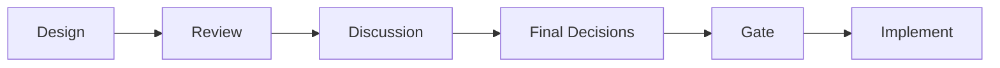
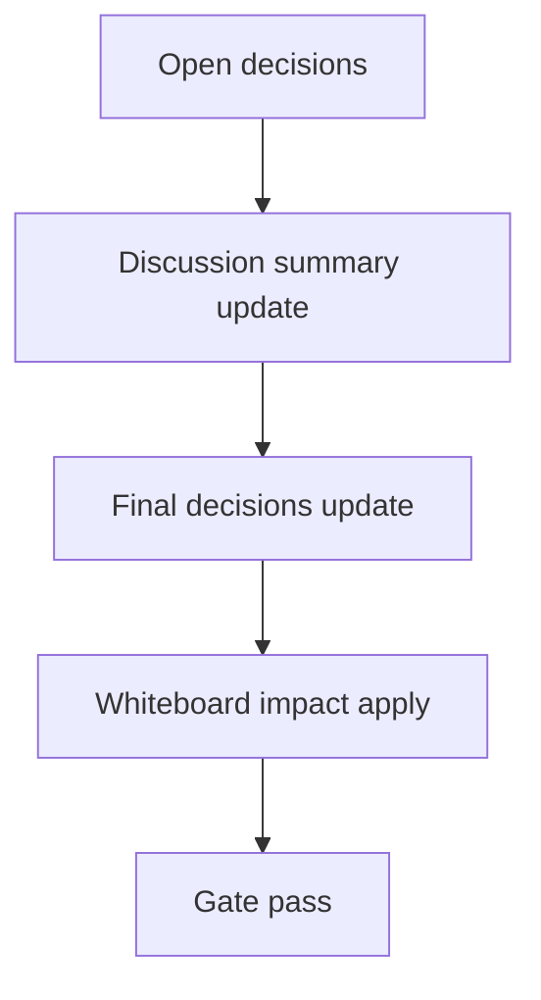

# Design: design_20260304_ui_polish_staroffice_claw_v1

- Status: Draft
- Owner: Codex
- Created: 2026-03-04
- Updated: 2026-03-04
- Scope: UI Polish v1: Star Office + Agent HQ inspirations (keep chat + character sheet)

## Context
- Problem: Current UI is functionally rich but visual language and right-pane readability are inconsistent across Character Sheet / dashboard operation cards / tracker panels, and long IDs/JSON can still degrade scanability.
- Goal: Keep Discord-like IA and existing chat/Character Sheet flows, while raising visual clarity and one-click operability by applying unified UI tokens, card patterns, right-pane organization, and workspace "office/status" expression using existing state only.
- Non-goals: No backend API additions in v1, no channel/function removal, no behavior changes to existing task execution semantics or confirm gates.

## Design diagram

## Whiteboard impact
- Now: Before: dashboard/workspace/right-pane have mixed card/badge/overflow patterns and operational cards are harder to scan under long text. After: a shared token/card/badge/mono/wrap system keeps layout stable and improves command-center readability while preserving all current routes.
- DoD: Before: Character Sheet exists but presentation and action prominence are inconsistent with workspace/dashboard context. After: Character Sheet remains and is reorganized as status screen (header/profile/memory/activity/ops cards), workspace seat cards expose status-to-action cues, and dashboard ops/tracker cards use unified status styling.
- Blockers: None for UI-only scope.
- Risks: CSS changes could unintentionally affect non-target panels; mitigation is additive class strategy and smoke-gate verification.

## Multi-AI participation plan
- Reviewer:
  - Request: Validate that Discord-like IA and existing entry points (chat/workspace/member/inbox thread) are preserved while visual polish is additive.
  - Expected output format: `pass/fail` bullets with impacted section + regression risk.
- QA:
  - Request: Verify acceptance command set and check no UI overflow regressions for long IDs/snippets/JSON in right-pane cards.
  - Expected output format: command checklist with exit code and assertion note.
- Researcher:
  - Request: Confirm UI-only feasibility using existing data/state and list any backend additions as "next phase proposal only".
  - Expected output format: endpoint/state compatibility list and deferred proposal bullets.
- External AI:
  - Request: Optional only; not required for this v1 polish scope.
  - Expected output format: N/A.
- external_participation: optional
- external_not_required: true

## Open Decisions
- [x] How far to change visuals without risking route/function regressions?
- [x] Whether to add backend API for richer "office status" in v1?

### Open Decisions checklist
- [x] Add "Decision 1 Final:" entry with final choice.
- [x] Add "Decision 2 Final:" entry with final choice.

## Final Decisions
- Decision 1 Final: Use additive UI token + utility classes and targeted class wiring only; keep existing component/data flow and channel navigation intact.
- Decision 2 Final: Keep v1 strictly UI-only; if richer office state is needed, document as next-phase design proposal (separate PR).

## Discussion summary
- Change 1: Introduce a unified visual system (tokens/cards/badges/mono/wrap) that preserves Discord-like structure but improves command-center readability.
- Change 2: Keep chat and Character Sheet v1 as mandatory existing surfaces; improve only presentation and one-click prominence.
- Change 3: Prioritize right-pane overflow hardening and operational card readability (Ops Quick Actions / Unified Quick Actions / Tracker).
- Change 4: Preserve workspace seat -> Character Sheet and member list -> Character Sheet routes unchanged.

## Plan
1. Design
2. Review
3. Implement
4. Verify

## Risks
- Risk: Global CSS token changes may cause unintended contrast/spacing shifts.
  - Mitigation: Keep tokens compatible with existing palette and use additive classes on targeted panels.
- Risk: Right-pane cards can still break on long machine strings.
  - Mitigation: Apply wrap/mono/horizontal-scroll utilities consistently to IDs/snippets/JSON areas.

## Test Plan
- Unit: `npm.cmd run ui:build:smoke:json` for compile/build stability.
- E2E:
  1. `npm.cmd run docs:check:json`
  2. `powershell -NoProfile -ExecutionPolicy Bypass -File tools/design_gate.ps1 -DesignPath docs/design/design_20260304_ui_polish_staroffice_claw_v1.md`
  3. `powershell -NoProfile -ExecutionPolicy Bypass -File tools/ui_smoke.ps1 -Json`
  4. `npm.cmd run ui:build:smoke:json`
  5. `npm.cmd run desktop:smoke:json`
  6. `node tools/ci_smoke_gate_runner.cjs`
  7. `powershell -NoProfile -ExecutionPolicy Bypass -File tools/whiteboard_update.ps1 -DryRun -Json` (expect `changed=false`)

## Reviewed-by
- Reviewer / approved / 2026-03-04 / additive UI polish keeps IA and one-click routes unchanged
- QA / approved / 2026-03-04 / acceptance commands and overflow hardening criteria are explicit
- Researcher / noted / 2026-03-04 / backend additions deferred to next-phase proposal only

## External Reviews
- none / optional
