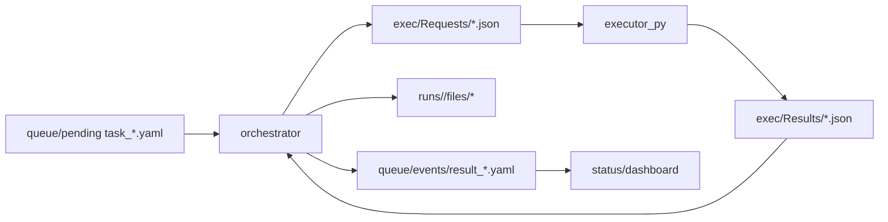
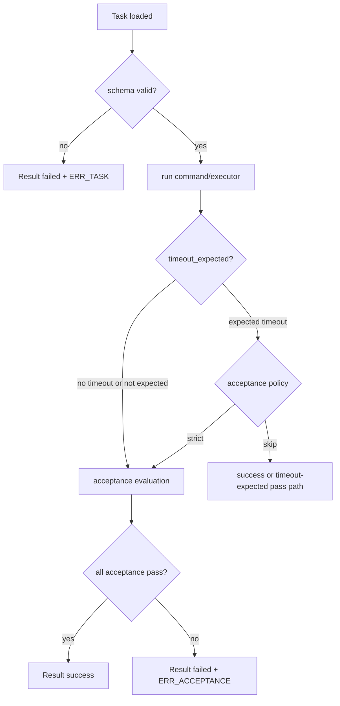

# region_ai Spec (SSOT)

This document is the platform-level SSOT for region_ai behavior and contracts.
For Task/Result field-level detail, see `docs/spec_task_result.md`.

## Table of contents
- Overview
- SSOT files and directories
- Primary execution paths
- Design-first workflow contract
- Workspace/exec resolution contract
- Parallelism / Concurrency
- Task/Result validation contract
- Acceptance contract
- Artifacts contract
- Error code contract
- status:json contract
- Data flow diagram
- Decision flow diagram

## Overview
- `apps/orchestrator`: queue watcher, task lifecycle controller, Result writer.
- `apps/executor_py`: executes commands from exec requests and returns exec results.
- `tools/*.ps1`: operational entrypoints (`start/stop/status`, `run_e2e`, `design_gate`, `whiteboard_update`).
- `templates/tasks/e2e/*.yaml`: E2E templates covering success/failure/reject paths.
- Workspace: queue/events/dashboard/runs and process logs.

## SSOT files and directories
- `docs/spec_region_ai.md`: platform SSOT (this file).
- `docs/spec_task_result.md`: Task/Result schema and acceptance detail SSOT.
- `docs/recipes_region_ai.json`: machine-readable recipes catalog SSOT.
- `docs/contract_index_region_ai.json`: schema-derived contract index SSOT (`task_kinds`, `acceptance_keys`, `artifact_keys`).
- `docs/design/LATEST.txt`: active design pointer (`relative | absolute`).
- `docs/whiteboard_region_ai.md`: operational Now/DoD SSOT.
- `docs/design/packs/<design_id>/manifest.json`: review prompt provenance (`sha256` included).
- `templates/tasks/recipes/*.yaml`: production-ready golden task templates guarded by recipe E2E scripts.
- `tools/recipes_update.ps1`: recipes catalog generator and drift checker (`-DryRun -Json`).
- `tools/contract_index_update.ps1`: contract index generator and drift checker (`-DryRun -Json`).
- `tools/ui_smoke.ps1`: UI API availability smoke (`/api/ssot/recipes` 200 check).
- `tools/ui_build_smoke.ps1`: ui_discord reproducible build smoke (`npm ci` + `ui:build`).
- `tools/desktop_smoke.ps1`: desktop shell smoke (Electron window create/exit).
- UI runtime state (org/activity):
- UI runtime state (memory):
  - `workspace/ui/memory/<agent_id>/episodes.jsonl`
  - `workspace/ui/memory/<agent_id>/knowledge.jsonl`
  - `workspace/ui/memory/<agent_id>/procedures.jsonl`
  - `workspace/ui/heartbeat/heartbeat_settings.json`
  - `workspace/ui/heartbeat/heartbeat_state.json`
  - `workspace/ui/heartbeat/heartbeat.lock`
  - `workspace/ui/heartbeat/autopilot_suggestions.json`
  - `workspace/ui/heartbeat/autopilot_suggest_settings.json`
  - `workspace/ui/heartbeat/autopilot_suggest_state.json`
  - `workspace/ui/consolidation/consolidation_settings.json`
  - `workspace/ui/consolidation/consolidation_state.json`
  - `workspace/ui/consolidation/consolidation.lock`
  - `workspace/ui/routines/morning_brief_settings.json`
  - `workspace/ui/routines/morning_brief_state.json`
  - `workspace/ui/routines/morning_brief.lock`
  - `workspace/ui/routines/morning_brief_bundle_requests.json`
  - `workspace/ui/routines/morning_brief_bundle_tracking.json`
  - `workspace/ui/dashboard/tracker_history.jsonl`
  - `workspace/ui/desktop/archive/threads/thread_<thread_key_sanitized>_<YYYYMMDD>.jsonl`
  - `workspace/ui/desktop/archive/thread_archive_state.json`
  - `workspace/ui/desktop/archive/thread_archive_scheduler_settings.json`
  - `workspace/ui/desktop/archive/thread_archive_scheduler_state.json`
  - `workspace/ui/desktop/archive/thread_archive_scheduler.lock`
  - `workspace/ui/org/agents.json`
  - `workspace/ui/org/agent_presets.json`
  - `workspace/ui/activity/activity.jsonl`
- Org agent schema extension:
  - `agents[].identity` (optional):
    - `tagline: string`
    - `values: string[]` (max 5)
    - `speaking_style: string`
    - `strengths: string[]` (max 5)
    - `weaknesses: string[]` (max 5)
    - `do: string[]` (max 5)
    - `dont: string[]` (max 5)
    - `focus: string`
  - `agents[].thread_key` (optional): latest inbox thread key hint for direct thread view navigation.
  - `agents[].active_preset_set_id` / `target_preset_set_id` / `recommended_preset_set_id` (optional): additive profile alignment hints for dashboard/character-sheet UI.
- UI API additive endpoints:
  - `GET /api/inbox`
    - response items always include additive `thread_key` (if persisted row has no `thread_key`, server derives deterministically from source).
  - `GET /api/inbox/thread?key=...&limit=...`
    - `key` validation: `1..80` chars and `^[a-z0-9:_-]+$`
    - scans inbox JSONL from tail, matches derived/effective `thread_key`, returns newest-first list.
  - `POST /api/inbox/thread/read_state`
    - body: `{ thread_key, mode:\"mark_read\", limit_scan? }`
    - validates same `thread_key` rule as inbox thread API.
    - scans inbox tail (bounded by `limit_scan`, default 2000, max 20000) and marks matched thread items read with stable keys (`id|msg_id|request_id|hash` fallback) into additive `read_state.thread_keys`.
    - returns machine-readable payload: `action/thread_key/marked_read/scanned/exit_code`.
  - `POST /api/inbox/thread/archive`
    - body: `{ thread_key, dry_run?, max_items?, limit_scan?, since_ts?, tail_bytes?, audit_mode? }`
    - non-destructive contract: source inbox JSONL is never modified; matched items are appended to `workspace/ui/desktop/archive/threads/thread_<thread_key_sanitized>_<YYYYMMDD>.jsonl`.
    - default `since_ts` is resolved from archive state (`workspace/ui/desktop/archive/thread_archive_state.json`), unless body overrides.
    - scan policy: prefer tail-bytes capped read (`tail_bytes` default 1MB, min 64KB, max 5MB), fallback to line scan when needed.
    - caps: `max_items` default 200/max 500, `limit_scan` default 5000/max 50000, line bytes max 64KB (oversize lines are skipped and reported).
    - `audit_mode=default|none` (default=`default`): `none` suppresses per-thread inbox audit (for scheduler summary-only runs).
    - successful non-dry run appends audit inbox item (`source=inbox_thread_archive`) unless `audit_mode=none`.
  - `GET /api/inbox/thread_archive_scheduler/settings`
  - `POST /api/inbox/thread_archive_scheduler/settings`
    - partial merge with validation; additive fields include:
      - `safety.per_thread_timeout_ms` (500..30000)
      - `safety.total_timeout_ms` (1000..120000, `>= per_thread_timeout_ms`)
      - `scan.tail_bytes` (65536..5242880)
  - `GET /api/inbox/thread_archive_scheduler/state`
    - additive state fields may include:
      - `last_elapsed_ms`
      - `last_timed_out`
      - `last_results_sample[]` (max 10)
      - `last_failed_thread_keys[]` (max 10)
      - `next_run_local` (computed response-only field, not persisted)
  - `POST /api/inbox/thread_archive_scheduler/run_now`
    - body: `{ dry_run?: boolean, thread_keys?: string[] }`
    - dry-run returns plan/results only (no write/no audit); run executes non-destructive archive per allowlist with lock/safety guards.
  - `GET/POST /api/org/agents`
  - `GET /api/org/agent_presets`
    - returns preset summaries (`preset_set_id`, `display_name`, `description`) from fixed workspace path with allowlist IDs.
  - `GET /api/org/agent_presets/:id`
    - returns one full preset set (roles + `identity_traits`).
  - `GET /api/org/active_profile`
    - returns current active council profile from workspace SSOT (`workspace/ui/org/active_profile.json`).
    - parse/missing fallback is normalized default (`standard`) with additive `note`.
  - `POST /api/org/active_profile/revert`
    - body: `{ target_preset_set_id?: "standard", confirm_phrase?: "REVERT", dry_run?: boolean, thread_key?: string, reason?: string }`
    - default is `dry_run=true` (preview only).
    - `dry_run=false` requires `confirm_phrase="REVERT"`; mismatch returns `ERR_CONFIRM_REQUIRED` (`details.which="REVERT"`).
    - target allowlist in v3.5 is fixed to `standard`.
    - response is normalized with additive fields: `preflight`, `apply_result` (execute only), `active_profile_preview` (dry-run), `active_profile` (execute), `thread_key`.
  - `POST /api/org/agents/apply_preset`
    - body: `{ preset_set_id, scope?: "council"|"agent", agent_id?: string, dry_run?: boolean, applied_by?: string, reason?: string, thread_key?: string }`
    - `scope=council` updates facilitator/critic/operator/jester identity in one action.
    - `scope=agent` is limited to council-role agents in v2.9 (`ERR_NOT_SUPPORTED` otherwise).
    - `dry_run=true` returns diff preview only (no file write).
    - response includes additive fields:
      - `applied_ids[]`
      - `diff_sample{agent_id:{before_hash,after_hash,changed}}`
      - `active_profile_preview{preset_set_id,display_name,reason,computed_at}` (dry-run)
      - `active_profile_updated` + `active_profile` (apply)
      - `note`, `exit_code`
  - `GET /api/memory/:agent_id/:category`
  - `POST /api/memory/:agent_id/:category`
  - `GET /api/memory/search`
  - `POST /api/heartbeat/run` (`agent_id`, `category`, capped limits, optional `dry_run`)
  - `GET /api/heartbeat/settings`
  - `POST /api/heartbeat/settings` (partial merge with range validation)
  - `GET /api/heartbeat/state`
  - `POST /api/heartbeat/run_now` (`dry_run` supported; respects lock and max_per_day safety)
  - `GET /api/heartbeat/autopilot_suggestions`
  - `POST /api/heartbeat/autopilot_suggestions/:id/accept`
    - optional body:
      - `{ rank?: 1|2|3, preset_rank?: 1|2|3, preset_set_id?: string, dry_run?: boolean }`
    - preset resolution order:
      - explicit `preset_set_id`
      - `preset_rank` from `suggestion.preset_candidates`
      - `rank`-matched `suggestion.preset_candidates`
      - fallback: preset apply skipped (legacy-compatible)
    - `dry_run=true`: applies preset in preview mode only, returns `preset_apply_status=preview_ok`, and does not start autopilot.
    - `dry_run=false`: applies preset first; if apply fails, returns `ok=false` and autopilot is not started.
  - `POST /api/heartbeat/autopilot_suggestions/:id/dismiss`
  - `GET /api/heartbeat/autopilot_suggest_settings`
  - `POST /api/heartbeat/autopilot_suggest_settings`
  - `GET /api/heartbeat/autopilot_suggest_state`
  - `GET /api/consolidation/settings`
  - `POST /api/consolidation/settings`
  - `GET /api/consolidation/state`
  - `POST /api/consolidation/run_now`
  - `GET /api/routines/morning_brief/settings`
  - `POST /api/routines/morning_brief/settings`
  - `GET /api/routines/morning_brief/state`
  - `POST /api/routines/morning_brief/run_now`
    - additive response includes:
      - `recommended_profile { preset_set_id, display_name, rationale, computed_at }`
    - `dry_run=true` returns `recommended_profile` without side effects.
  - `POST /api/export/morning_brief_bundle`
  - `GET /api/export/morning_brief_bundle/status`
  - `GET /api/dashboard/daily_loop` (aggregated daily loop status with capped inbox items)
    - additive response includes:
      - `recommended_profile { preset_set_id, display_name, rationale, computed_at }`
  - `GET /api/dashboard/next_actions?limit=...`
    - normalized dashboard actions payload for high-priority operator guidance.
    - response: `{ action: "dashboard_next_actions", items: [...], exit_code }`
    - `limit` clamp: default `5`, max `10`.
    - best-effort policy: always `200` with `items` array (empty on missing/parse failures).
    - `items[].kind="revert_suggestion"` fields:
      - `thread_key`, `created_at`, `active_preset_set_id`, `target_preset_set_id`, `quick_action_id="revert_active_profile_standard"`, `severity="high"`.
    - `items[].kind="profile_misalignment"` fields:
      - `active_preset_set_id`, `recommended_preset_set_id`, `severity="medium"`.
  - `POST /api/dashboard/recommended_profile/preflight`
    - computes deterministic recommended profile and runs preset apply preview (`dry_run=true`, `scope=council`).
    - response: `{ ok, recommended_profile, apply_preview, exit_code }`
  - `POST /api/dashboard/recommended_profile/apply`
    - body: `{ confirm_phrase: "APPLY" }`
    - confirm mismatch returns `ERR_CONFIRM_REQUIRED`.
    - on success applies recommended preset to council roles via existing apply_preset path and returns `{ ok, recommended_profile, apply_result, exit_code }`.
    - dashboard UI consumes `/api/activity/stream` and triggers debounced refresh of this endpoint on relevant events; falls back to polling when SSE is unavailable.
  - `GET /api/dashboard/quick_actions`
    - fixed v1 quick-action list for dashboard one-click dry-run controls.
    - each action includes `enabled` and `hint`; failures in capability probing are returned as disabled actions (`enabled=false`) instead of request failure.
  - `POST /api/dashboard/quick_actions/run`
    - body: `{ id: string, params?: object }`
    - v1 enforces dry-run behavior by action id and returns normalized payload (`ok/status_code/result/elapsed_ms/exit_code`).
    - failures are normalized in response payload (`ok=false`) to keep dashboard rendering stable.
  - `POST /api/dashboard/quick_actions/execute`
    - body: `{ id|execute_id: "thread_archive_scheduler"|"ops_snapshot"|"evidence_bundle"|"morning_brief_autopilot_start"|"revert_active_profile_standard", confirm_phrase?: "EXECUTE", apply_confirm_phrase?: "APPLY", dry_run?: boolean, params?: object }`
    - server-side allowlist + confirm-phrase required (`ERR_NOT_ALLOWED` / `ERR_CONFIRM_REQUIRED` on 400).
    - `id="morning_brief_autopilot_start"` and `dry_run=false` additionally require `apply_confirm_phrase="APPLY"` (`details.which="APPLY"` on mismatch).
    - `id="revert_active_profile_standard"` and `dry_run=true` allows preview without `confirm_phrase` (side-effect free).
    - `dry_run=true` is preflight preview mode (no side effects); `dry_run=false` runs selective execute mapping.
    - success and runtime failures use normalized payload (`action=id=dry_run=ok=status_code=result=elapsed_ms=exit_code=failure_reason`).
    - response additive fields:
      - `thread_key` (`^[a-z0-9:_-]+$`, len `1..80`)
      - `thread_key_source` (`request_id|run_id|fallback|preview`)
    - response additive tracking metadata:
      - `tracking_plan`: polling-safe plan (`status_endpoint`, `poll_hint_ms`, `max_duration_ms`, `fields_hint`).
      - `tracking`: present when execute path has tracking context (`request_id`/`run_id`/`started_at`/`kind`).
      - `morning_brief_autopilot_start` preview returns additive `result.recommended_profile`, `result.preflight_preview`, `result.autopilot_preview`.
      - `morning_brief_autopilot_start` execute tracking uses `kind=inbox_thread`, `tracking.poll_url=/api/inbox/thread?key=...`, and response `thread_key` aligns to autopilot thread.
    - dashboard UI additive behavior (v2.2, no API contract change):
      - terminal tracker snapshots are persisted locally (`localStorage` key `regionai.tracker_history.v1`, cap 10).
      - auto-close preference on success is local (`regionai.tracker_autoclose_success.v1`, default true).
    - dashboard UI additive behavior (v2.3, no API contract change):
      - export/import portability schema: `regionai.tracker_history.export.v1`
      - export payload shape: `{ schema, exported_at, count, items[] }` where `items[]` matches tracker history entry shape.
      - import validation is schema-first; invalid entries are skipped, merge is deduped and capped to latest 10.
  - `GET /api/dashboard/tracker_history?limit=...`
    - reads additive workspace history from `workspace/ui/dashboard/tracker_history.jsonl`.
    - `limit` is clamped to `1..50` (default `10`); response is latest-first validated items only.
    - tail-read policy: 256KB window, broken JSONL line skip, oversized line skip (64KB cap), returns `skipped_lines` and `truncated`.
  - `POST /api/dashboard/tracker_history/append`
    - body: `{ item, dry_run? }` where `item` follows tracker-history entry schema.
    - validates required strings and status enum (`success|failed|timeout|canceled`), caps `last_summary` to 200 chars.
    - `dry_run=true` validates only; `dry_run=false` appends one JSONL line.
  - inbox thread_key derivation (additive):
    - explicit valid `item.thread_key` is preferred.
    - for quick-actions/export linkage with `links.request_id`:
      - `export_ops_snapshot` -> `qa:ops_snapshot:<request_id_token>`
      - `export_evidence_bundle` -> `qa:evidence_bundle:<request_id_token>`
      - `quick_actions_execute` uses `links.kind` to map the same namespace.
    - when `links.run_id` exists and request_id mapping is unavailable, derived key may use `qa:run:<run_id_token>`.
  - `GET /api/dashboard/thread_archive_scheduler`
    - returns scheduler settings/state summary optimized for dashboard card observability.
  - `POST /api/dashboard/thread_archive_scheduler/run_now`
    - dry-run-only wrapper for dashboard action (`{ dry_run: true }`).
  - `GET /api/ops/quick_actions/status` (returns brakes/locks/log hints + short-lived confirm token)
  - `POST /api/ops/quick_actions/clear_stale_locks` (`dry_run` supported; stale-only allowlist delete)
  - `POST /api/ops/quick_actions/reset_brakes` (`dry_run` supported; resets effective brakes only)
  - `POST /api/ops/quick_actions/stabilize` (`mode=dry_run|safe_run`, confirm token required)
  - `GET /api/ops/auto_stabilize/settings`
  - `POST /api/ops/auto_stabilize/settings`
  - `GET /api/ops/auto_stabilize/state`
  - `POST /api/ops/auto_stabilize/run_now` (dry-run only safety)
  - `POST /api/ops/auto_stabilize/execute_safe_run` (requires confirm token; supports safe/no-exec or safe+run_now)
    - auto-stabilize v6 monitor may internally call this endpoint semantics with `include_run_now=false` only
    - `auto_execute` settings (additive):
      - `enabled` (default false)
      - `mode="safe_no_exec"` (fixed)
      - `confirm_policy="server_only"` (fixed)
      - `max_per_day` (1..5)
      - `cooldown_sec` (300..21600)
  - `GET /api/activity`
    - includes `event_type=memory_append` for append-only memory writes
    - includes `event_type=heartbeat` for heartbeat digest append
  - Heartbeat suggestion policy:
    - heartbeat `dry_run=false` may create one deterministic open suggestion per `local_date + agent_id + category` (dedup).
    - suggestions are stored append-safe with bounded list (`<=200`).
    - each suggestion may include ranked candidates (`<=3`) with rationale; legacy single `topic/context` is still accepted and converted to rank1 on read.
    - suggestion v3.0 additive fields:
      - `preset_candidates[]` (`rank`, `preset_set_id`, optional `display_name`)
      - `preset_candidates[].source` (`recommended_profile|static`, optional)
      - `selected_preset_set_id`
      - `preset_apply_status` (`not_applied|preview_ok|applied|failed`)
      - `preset_apply_error` (best-effort reason/details)
      - `recommended_profile_snapshot` (`preset_set_id`, `display_name`, `rationale`, `computed_at`)
    - v3.2 alignment:
      - suggestion rank1 preset is derived from `computeRecommendedProfile()` (single source of truth)
      - rank2/3 are static fallbacks with de-duplication against rank1
    - accepting suggestion supports safe preflight/apply/start:
      - preflight (`dry_run=true`) -> apply preview only
      - apply+start (`dry_run=false`) -> apply preset then start autopilot
    - on preset apply failure, start is blocked
  - Recommended profile policy (v3.1):
    - deterministic mapping:
      - ops brake/stale/failure signal -> `ops_first`
      - recent failure/drift-like signal -> `harsh_critic`
      - otherwise -> `standard`
    - chosen preset id is validated against preset SSOT allowlist; missing id falls back to `standard`.
    - v2 optional auto-accept is guarded and default-off:
      - facilitator + episodes + rank1 only
      - once/day and cooldown checks
      - fixed autopilot params (`max_rounds=1`, `auto_ops_snapshot=true`, evidence/release off)
      - consecutive auto-accept failure brake (`auto_accept_enabled_effective=false` with mention inbox notify)
  - Night consolidation policy:
    - source category fixed to episodes; outputs are knowledge/procedures append-only.
    - scheduler supports daily time with lock/cooldown/max_per_day/backoff safety.
  - Morning brief routine policy:
    - facilitator-focused safe orchestration with once/day + cooldown + failure brake.
    - no automatic evidence/release kick; ops snapshot only via fixed safe autopilot settings.
  - Morning brief bundle policy:
    - deterministic queue pipeline writes brief + manifest and archives them to zip.
    - tracking status uses `queued|running|success|failed` with inbox dedup notify (`source=export_morning_brief_bundle`).
    - dry-run returns plan only and does not enqueue.
  - Inbox thread archive scheduler policy:
    - nightly run with lock stale-recovery, once/day + cooldown + max_per_day.
    - cooperative timeout guards (`per_thread_timeout_ms` and `total_timeout_ms`) prevent long hangs.
    - summary inbox audit (`source=inbox_thread_archive_scheduler`) is one entry per run; per-thread audit can be suppressed.
    - failure brake disables `enabled_effective` after consecutive failures and emits stop audit (`source=inbox_thread_archive_scheduler_stopped`).
  - `GET /api/activity/stream` (SSE realtime feed, best-effort)
  - `POST /api/council/run` (supports `{ resume: true, run_id }`, optional `dry_run: true`, and optional `auto_ops_snapshot` / `auto_evidence_bundle` / `auto_release_bundle`)
    - additive response fields: `thread_key`, `thread_key_source` (`request_id|run_id|fallback|preview`), `inbox_thread_hint.open_thread_endpoint`
    - dry-run additive preview fields: `round_log_format_preview` and `round_log_format_version` (`v2_8`)
    - optional dry-run metadata: `identity_hints_used`, `memory_hints_used` (boolean)
    - dry-run additive preview: `revert_suggestion_preview { should_suggest:boolean, target_preset_set_id:\"standard\", quick_action_id:\"revert_active_profile_standard\", thread_key, reason:\"autopilot_final\" }`
  - `GET /api/council/run/status`
  - `POST /api/council/run/cancel`
  - `POST /api/council/artifact/queue`
- Desktop role-view partition contract:
  - right pane keeps per-role ChatGPT BrowserViews with fixed partitions:
    - `persist:chatgpt_facilitator`
    - `persist:chatgpt_design`
    - `persist:chatgpt_impl`
    - `persist:chatgpt_qa`
    - `persist:chatgpt_jester`
  - bridge operations are applied to the currently active role view.
  - region UI may request role switch via `window.postMessage({ type: "regionai:focusRole", role })`.
- Activity delivery policy:
  - UI prefers SSE stream for realtime updates.
  - When stream fails/unavailable, UI falls back to polling (`/api/activity`, 2s interval).
  - Character Sheet v1 policy:
    - right-pane sheet opens from workspace/member `ステータス` action and keeps chat pane primary.
    - sheet live activity is actor-filtered (`actor_id == selected_agent_id`), deduped by event id, capped to latest 10.
    - sheet stream is active only while sheet is open; fallback polling interval is 5s.
    - sheet memory snapshot uses existing memory APIs only (`/api/memory/:agent_id/:category?limit=...`) with no new backend endpoint.
- Council autopilot runtime state:
  - `workspace/ui/council/runs/<run_id>.json` (status snapshot)
  - `workspace/ui/council/logs/<run_id>.jsonl` (step log stream)
  - `workspace/ui/council/requests/<run_id>.json` (desktop pickup request)
  - additive persisted fields in run/request: `thread_key`, `thread_key_source`
  - additive inbox tracking state: `workspace/ui/council/inbox_tracking.json`
  - additive revert-suggest dedupe state: `workspace/ui/org/revert_suggest_state.json`
  - thread key rule: `ap:*` namespace using sanitized token (`^[a-z0-9:_-]{1,80}$`)
  - completion queues safe artifact task (answer markdown and optional bundle)
  - quality stabilization v1.2:
    - `reflection.max_attempts` is fixed to `1`
    - if first quality check fails, facilitator reflection pass runs once
    - if second quality check fails, run finalizes as `failed_quality` (no retry loop)
    - best-effort artifact is still queued with quality failure banner
  - auto exports v1.3:
    - `exports.auto_ops_snapshot`, `exports.auto_evidence_bundle`
    - `exports.ops_snapshot_request_id`, `exports.evidence_bundle_request_id` for idempotent kick tracking
    - `exports.status.ops_snapshot|evidence_bundle` (`disabled|queued|done|failed`)
    - council does not write export completion inbox entries directly; existing export tracking remains the notifier
  - auto release bundle v1.4:
    - `exports.auto_release_bundle`
    - `exports.release_bundle_request_id`, `exports.release_bundle_status`, `exports.release_bundle_run_id`
    - release bundle kick reuses existing `recipe_release_bundle` execution path and writes no custom arbitrary file paths
  - inbox linkage v2.6:
    - start/round/final append to `#inbox` with same `thread_key` (`source=council_autopilot`, `council_autopilot_round`, `council_autopilot_final`)
    - append is best-effort and must not break autopilot control flow on failure
    - round append cap: max 5 entries; final failure sets `mention=true` with mention token fallback
  - final revert suggestion v3.6:
    - on final state and non-standard active profile, append `source=revert_suggestion` in same autopilot `thread_key`
    - dedupe key is `thread_key + local_date` (state-backed, best-effort tail scan fallback)
    - suggestion only; no automatic profile apply/revert execution
  - round log role format v2.7:
    - `council_autopilot_round` body uses fixed role labels with line breaks:
      - `司会: 決定=... / 次=...`
      - `批判役: リスク=... / 反例=...`
      - `実務: 実装案=... / 手順=...`
      - `道化師: 前提崩し=... / うっかり=...`
    - field-level normalization compresses whitespace and truncates with `…(truncated)` when capped
  - identity/memory assist v2.8:
    - role lines may include best-effort hints from agent identity traits and recent memory snippets
    - minimum non-empty guarantee applies per role line via fallback templates when slots are empty
- Drift-check note: docs_check treats Mermaid coverage as the number of ````mermaid` occurrences in `docs/spec_region_ai.md`.

## Primary execution paths
- Runtime operations:
  - `npm.cmd run region_ai:start`
  - `npm.cmd run region_ai:status`
  - `npm.cmd run region_ai:stop`
- Gate-required E2E:
  - `cd apps/orchestrator && npm.cmd run e2e:auto`
  - `cd apps/orchestrator && npm.cmd run e2e:auto:json`
  - recipe path hardening v1:
    - `cd apps/orchestrator && npm.cmd run e2e:auto:recipe_morning_brief_bundle:json` resolves repo root then executes `tools/run_e2e.ps1 -Mode recipe_morning_brief_bundle -IsolatedWorkspace -Json`.
    - `cd apps/orchestrator && npm.cmd run recipes:all` resolves repo root then executes `tools/recipes_all.ps1 -Json` (sequential fail-fast, final one-line JSON).
- Dev escape hatch:
  - `cd apps/orchestrator && npm.cmd run e2e:auto:dev`
  - `cd apps/orchestrator && npm.cmd run e2e:auto:dev:json`
  - These set `-SkipDesignGate`; JSON must show `gate_phase=skipped`.
- Lightweight smoke:
  - `powershell -NoProfile -ExecutionPolicy Bypass -File tools/ci_smoke.ps1`
  - `powershell -NoProfile -ExecutionPolicy Bypass -File tools/ui_smoke.ps1 -Json`

## patch_apply flow
- Command contract: `spec.command=patch_apply` with `spec.patch.format=unified` and patch text payload.
- Validation: schema and light checks run before execution; invalid contract yields `ERR_TASK` with machine-readable details.
- Runtime: orchestrator delegates `mode=patch_apply` to executor, executor applies patch only inside workspace root.
- Safety: patch targets with absolute, UNC, or traversal paths are rejected.
- Classification: runtime apply failure (hunk mismatch/target not found/cannot apply) is `ERR_EXEC`.

## pipeline flow
- Top-level kind: `pipeline` with ordered `steps[]` execution.
- Execution model: orchestrator runs steps sequentially and stops at first failure.
- Step policy: known non-pipeline step kinds only; nested pipeline is rejected as `ERR_TASK`.
- Error propagation: failed step error code is propagated to pipeline result with step metadata.
- Acceptance: evaluated once against aggregated stdout/stderr of executed steps.

## file_write flow
- Command contract: `spec.command=file_write` with `spec.files[]` text write items.
- Validation: schema + light pre-validation enforce path policy, file count, and byte limits before execution.
- Runtime: orchestrator delegates `mode=file_write` to executor; executor writes under workspace root only.
- Artifacts: executor mirrors written files under `runs/<run_id>/files/written/...` and writes `written_manifest.json`.
- Classification: pre-validation/path/limit violations are `ERR_TASK`; runtime I/O failures are `ERR_EXEC`.

## archive_zip flow
- Command contract: `spec.command=archive_zip` with `spec.inputs[]` and `spec.output.{zip_path,manifest_path}`.
- Validation: schema + light pre-validation enforce path policy and limit policy.
- Runtime: orchestrator delegates `mode=archive_zip` to executor; executor resolves workspace-local files and writes zip/manifest to run artifacts.
- Safety: absolute/UNC/traversal path is rejected; output remains under `runs/<run_id>/files`; symlink follow defaults to false.
- Classification: pre-validation invalid is `ERR_TASK`; runtime zip/manifest/input resolution errors are `ERR_EXEC`.

## Design-first workflow contract
- Standard operation is gate-required (`design_gate` + whiteboard consistency check).
- Dev path is an explicit exception (`-SkipDesignGate`) and is not used in CI/shared operation.
- Whiteboard consistency is mandatory: `docs/whiteboard_region_ai.md:last_design_id` must match `docs/design/LATEST.txt`.
- Design must declare external participation policy: `external_participation: optional|required|none`.
- Gate validates external policy declaration and required external evidence based on the chosen mode.

## Workspace/exec resolution contract
- Workspace environment variables:
  - `REGION_AI_WORKSPACE`
  - `REGION_AI_EXEC_ROOT`
  - `REGION_AI_WORKSPACE_SELECTED` (debug/supporting)
- `run_e2e.ps1`/runtime scripts force-set these values before child execution.
- Default workspace root: `%TEMP%\region_ai\workspace`.
- Default exec root: `<workspace>\exec`.
- Operational logs must include workspace/exec context for diagnosis.

## Parallelism / Concurrency
- Default behavior: shared workspace E2E is serialized by `tools/run_e2e.ps1` lock.
- Lock target: `<workspace_root>\locks\run_e2e.lock\owner.json`.
- When lock is busy:
  - default `LockTimeoutSec=0` => fail-fast (`phase=workspace_lock`, exit 1).
  - `LockTimeoutSec>0` => poll until timeout, then fail with the same phase.
- Stale lock handling:
  - owner PID dead => auto reclaim and continue.
  - `-ForceUnlock` => explicit reclaim override.
- Parallel runs are supported only with isolated workspace mode:
  - `-IsolatedWorkspace` and no explicit `-WorkspaceRoot` uses `%TEMP%\region_ai\workspaces\<run_id>\workspace`.
  - exec root remains `<workspace>\exec`.
- `run_e2e -Json` concurrency keys:
  - `lock_mode` (`workspace_lock|isolated`)
  - `lock_acquired` (`true|false`)
  - `lock_path`
  - `lock_owner_pid` (when known)

## Task/Result validation contract
- Task validation occurs before command execution.
- Validation source of truth:
  - `schemas/task.schema.json`
  - `docs/spec_task_result.md`
- On pre-validation failure (Option A):
  - `Result.status=failed`
  - `errors[0].code=ERR_TASK`
  - `run_id` is allocated
  - `runs/<run_id>/artifacts.json` is **not expected**
  - `errors[0].details.schema_errors` is populated for schema failures

## Acceptance contract
- Supported acceptance types:
  - `stdout_contains`
  - `stdout_regex`
  - `stderr_contains`
  - `stdout_not_contains`
  - `stderr_not_contains`
  - `command_exit_code`
  - `artifact_exists`
  - `artifact_file_contains`
  - `artifact_file_not_contains`
  - `artifact_file_regex`
  - `artifact_file_not_regex`
  - `artifact_json_pointer_equals`
  - `artifact_json_pointer_regex`
  - `artifact_json_pointer_exists`
  - `artifact_json_pointer_not_exists`
  - `artifact_json_pointer_gt`
  - `artifact_json_pointer_gte`
  - `artifact_json_pointer_lt`
  - `artifact_json_pointer_lte`
  - `artifact_zip_entry_exists`
  - `artifact_zip_entry_not_exists`
  - `artifact_zip_entry_regex`
  - `artifact_zip_entry_not_regex`
- New acceptance behavior:
  - `stdout_regex`: compile regex from `pattern` and optional `flags` (`i|m|s|u` only), then test against stdout.
  - `stderr_contains`: pass when stderr includes `value`.
  - `stdout_not_contains`: pass when stdout does not include `value`.
  - `stderr_not_contains`: pass when stderr does not include `value`.
  - Compile/validation failures in these checks are treated as acceptance failure (`ERR_ACCEPTANCE`).
  - Boundary contract:
    - regex compile failure is evaluated at runtime and returns `ERR_ACCEPTANCE` (`details.note=regex_compile_error`).
    - invalid regex flags are rejected by schema pre-validation and return `ERR_TASK` with `schema_errors`.
    - regex evaluation input is bounded to the first `10000` chars (`MAX_REGEX_INPUT_CHARS`).
    - when regex input is truncated, `details.note` includes `input_truncated`.
  - Recommended failure details payload:
    - `kind`: acceptance type
    - `target`: `stdout` or `stderr`
    - `expected`: pattern/value
    - `actual_sample`: first `200` chars (fixed cap) from stdout/stderr
    - `note`: optional (`regex_compile_error`, `regex_flags_error`, `input_truncated`, etc.)
- `artifact_exists` rules:
  - relative path only
  - reject absolute path
  - reject traversal (`..`)
  - reject UNC-style path
  - pass only if both:
    - path exists in `artifacts.files`
    - file exists under `runs/<run_id>/files/`
- Artifact file content checks (`artifact_file_*`) rules:
  - path is resolved only under `runs/<run_id>/files/` (absolute/UNC/traversal rejected).
  - evaluator reads bounded content (`<=256KB`) and includes truncation notes in details.
  - invalid regex flags are pre-validation errors (`ERR_TASK`); content mismatch/missing/read failure is `ERR_ACCEPTANCE`.
- Artifact JSON pointer checks (`artifact_json_pointer_*`) rules:
  - input JSON source is artifact file under `runs/<run_id>/files/` only (same path policy as `artifact_file_*`).
  - JSON Pointer semantics follow RFC 6901 token unescape (`~0`, `~1`) and array index resolution.
  - invalid pointer/flags/path shape is pre-validation invalid (`ERR_TASK`).
  - parse failure/pointer mismatch/value mismatch are acceptance failures (`ERR_ACCEPTANCE`).
  - numeric compares (`gt/gte/lt/lte`) require finite numeric `value`; `NaN/Infinity` are pre-validation invalid (`ERR_TASK`).
  - numeric compares require resolved actual value to be finite number; otherwise `ERR_ACCEPTANCE` with `note=non_number`.
- Artifact ZIP entry checks (`artifact_zip_entry_*`) rules:
  - `zip_path` is resolved only under `runs/<run_id>/files/` (absolute/UNC/traversal rejected in pre-validation => `ERR_TASK`).
  - evaluator opens zip without extraction and lists central-directory entries.
  - invalid regex flags are pre-validation errors (`ERR_TASK`).
  - zip open/list failure, entry mismatch, regex mismatch are `ERR_ACCEPTANCE`.
  - regex compile failure is runtime acceptance failure (`ERR_ACCEPTANCE`) with `details.compile_error`.
  - caps: max `5000` entries, each entry max `512` chars, bounded `entries_sample` with truncation note.
- Timeout policy:
  - `runtime.timeout_expected=true`
  - `runtime.timeout_expected_acceptance=skip|strict`
  - `strict` keeps acceptance mandatory

## Artifacts contract
- `artifacts.files` contains **only** relative paths from `runs/<run_id>/files/`.
- No absolute paths in `artifacts.files`.
- Artifact reject E2E cases must fail with `ERR_ACCEPTANCE`.
- Optional run meta mirror:
  - enabled by `spec.artifact.mirror_run_meta=true`
  - writes `_meta/task.yaml`, `_meta/result_pre_acceptance.json`, `_meta/result.json` (or subset via include list)
  - meta write failure is execution failure (`ERR_EXEC`) with machine-readable details.

## Error code contract
- `ERR_TASK`: invalid task/spec/pre-validation failure.
- `ERR_ACCEPTANCE`: acceptance check failed.
  - JSON pointer numeric compare failures must keep details with:
    - `target_path`
    - `check_type` (`json_pointer_gt|json_pointer_gte|json_pointer_lt|json_pointer_lte`)
    - `pointer`
    - `expected_value`
    - `actual_value_type`
    - `actual_value_sample`
    - `note`
  - ZIP entry acceptance failures must keep details with:
    - `target_zip_path`
    - `check_type`
    - `entry` or `pattern`/`flags`
    - `entries_sample`
    - `total_entries` (when available)
    - `note`
- `ERR_TIMEOUT`: timeout where timeout is not expected.
- `ERR_EXEC`: execution/runtime failure after task pre-validation succeeded.
- `ERR_EXECUTOR`: executor-level failure bucket.
- Machine triage should prioritize:
  - `Result.metadata.status`
  - `Result.outcome.errors[0].code`

## status:json contract
- `status_region_ai.ps1 -Json` outputs one-line JSON only.
- Expected key areas:
  - process/alive/ready state
  - workspace and exec root
  - latest result summary (`latest_ok_result`, `latest_failed_result`)
  - expected-failure note for strict_ng style failure (`note_expected_failure`)

## Data flow diagram


## Decision flow diagram



